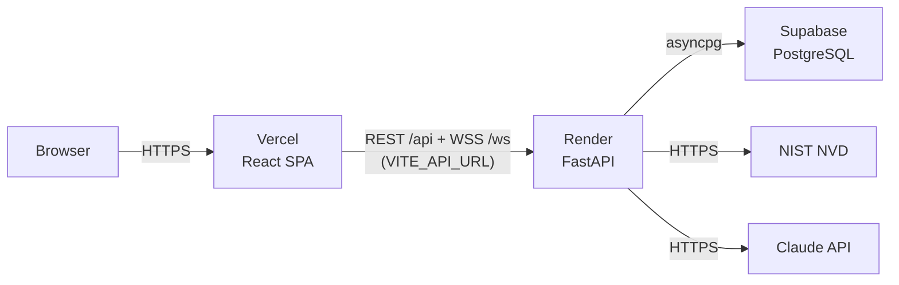

# Deployment Guide

Deploy SENTINEL SOC as a **decoupled** production stack on free tiers:

| Layer | Platform | Notes |
|-------|----------|-------|
| Frontend | **Vercel** | Static Vite build (`frontend/`) |
| Backend | **Render** | FastAPI web service (`backend/`, via `render.yaml`) |
| Database | **Supabase** | PostgreSQL event log (optional) |

> **Production mode = simulated telemetry only.** `render.yaml` sets
> `SOC_SCAN_ENABLED=0` and `SOC_SNIFF_ENABLED=0`. Real Nmap/Scapy scanning is
> intentionally **kept local** and never runs in the cloud.



Prerequisites: the repo is on GitHub, and free accounts on
[Supabase](https://supabase.com), [Render](https://render.com), and
[Vercel](https://vercel.com).

---

## 1 · Database — Supabase (optional but recommended)

The Postgres event log persists alerts for `GET /api/events`. Skip this step to
run without persistence (the app degrades gracefully).

1. **New project** → pick a region + strong DB password.
2. **Connect** (top bar) → copy the **Session pooler** or **Direct connection**
   URI — it looks like:
   ```
   postgresql://postgres.<ref>:<password>@aws-0-<region>.pooler.supabase.com:5432/postgres
   ```
3. Append SSL: add `?sslmode=require` to the end.

   > Use the **Session pooler / Direct** connection (not the *transaction*
   > pooler on port 6543). The backend already sets `statement_cache_size=0`
   > for pooler compatibility.

Keep this URI for step 2 (`DATABASE_URL`).

---

## 2 · Backend — Render

1. **New → Blueprint** → connect this GitHub repo. Render reads
   [`render.yaml`](render.yaml) and provisions the `sentinel-soc-api` web service.
2. Before the first deploy, set the secret env vars (marked *sync:false*):
   | Variable | Value |
   |----------|-------|
   | `DATABASE_URL` | the Supabase URI from step 1 (with `?sslmode=require`) — or leave blank |
   | `ANTHROPIC_API_KEY` | *(optional)* your Claude API key for live AI analysis |
   | `SOC_NVD_API_KEY` | *(optional)* an NVD API key for higher rate limits |

   `SOC_JWT_SECRET` is auto-generated; `SOC_CORS_ORIGIN_REGEX` is preset to allow
   any `*.vercel.app` origin; scanning is off.
3. **Create** → wait for the build, then copy the service URL, e.g.
   `https://sentinel-soc-api.onrender.com`.
4. Verify: open `https://sentinel-soc-api.onrender.com/api/health` →
   `{"status":"ok", ...}`.

---

## 3 · Frontend — Vercel

1. **Add New → Project** → import this GitHub repo.
2. **Root Directory → `frontend`** (important — the SPA lives there).
   Framework preset auto-detects **Vite**.
3. **Environment Variables** → add:
   | Variable | Value |
   |----------|-------|
   | `VITE_API_URL` | your Render URL from step 2 (e.g. `https://sentinel-soc-api.onrender.com`) |
4. **Deploy** → you get a URL like `https://sentinel-soc.vercel.app`.

Because `SOC_CORS_ORIGIN_REGEX` already allows `*.vercel.app`, no extra CORS
wiring is needed. (For a **custom domain**, add it to `SOC_CORS_ORIGINS` on Render.)

---

## 4 · Verify

Open the Vercel URL and log in with `admin` / `admin`:

- Status pill shows **LIVE**, packets stream, and the Vulnerability panel shows
  **live NVD** CVEs.
- Alerts persist to Supabase — check the `events` table, or `GET /api/events`.

---

## Notes & tips

- **Free-tier cold starts.** Render's free web service spins down after ~15 min
  idle; the first request wakes it (~30–60 s). Until it's awake the dashboard
  shows **SIMULATION**; reload once it's up to switch to **LIVE**.
- **Secrets** live only in platform env vars — never in git. Rotate
  `SOC_JWT_SECRET` and DB credentials as needed.
- **Production is read-safe.** No scanning, no packet capture — only simulated
  telemetry plus the live NVD feed and (optional) Claude analysis.
- **Redis** is not required in production (the NVD cache is optional). Add a
  Render Redis instance and set `REDIS_URL` if you want it.
