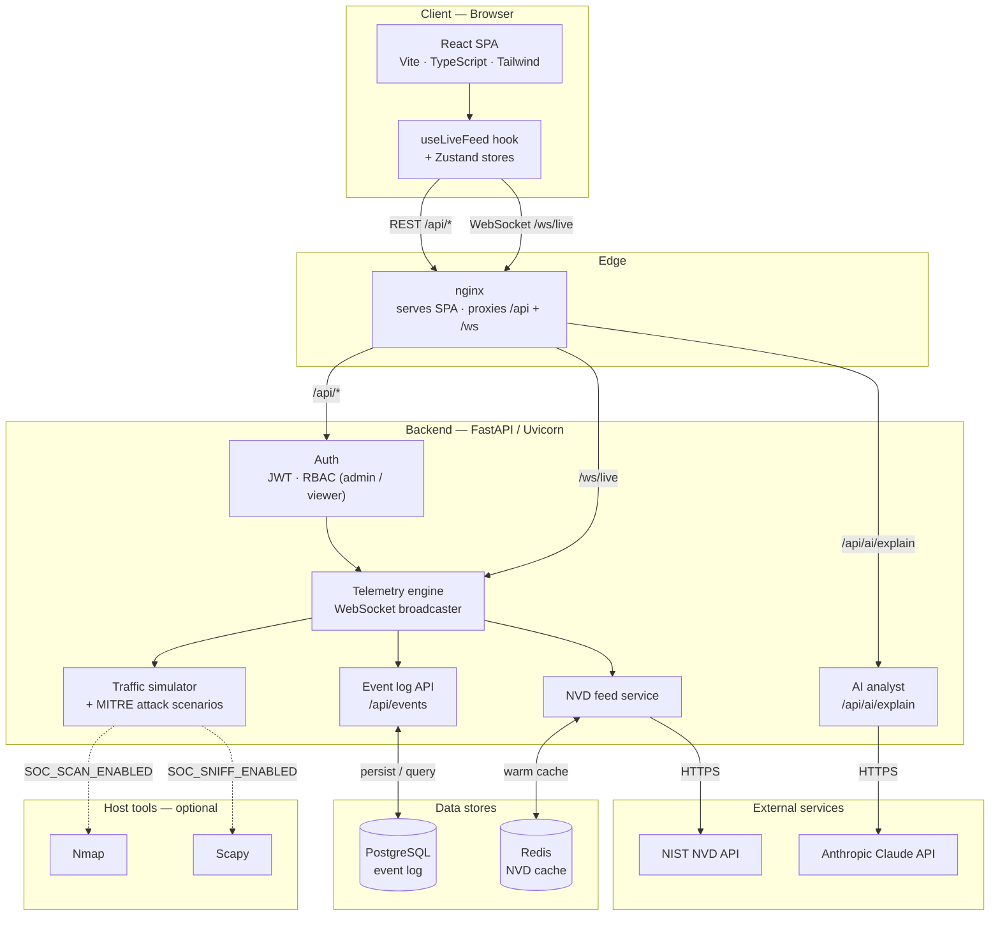
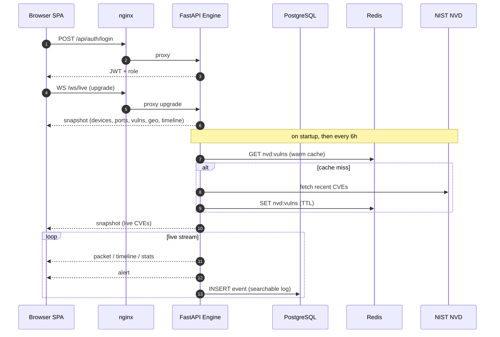
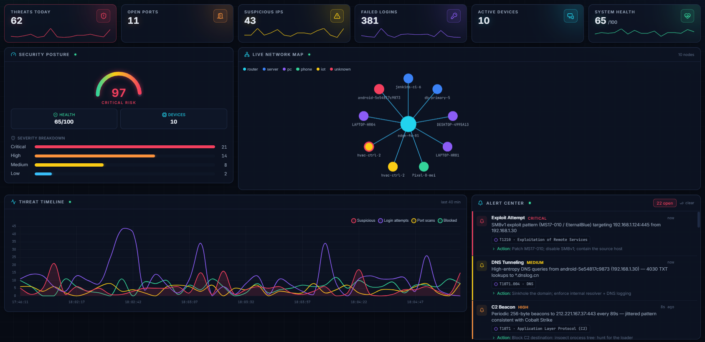
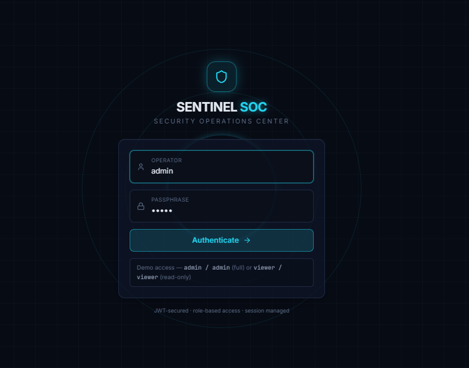
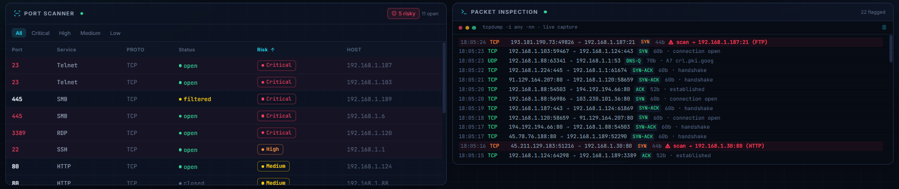
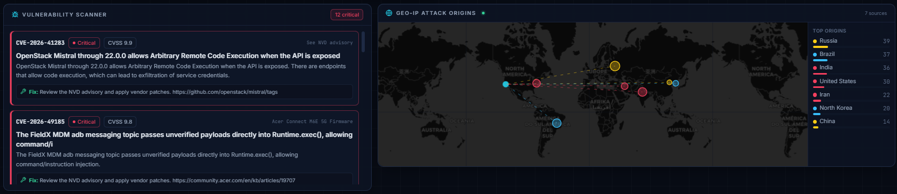
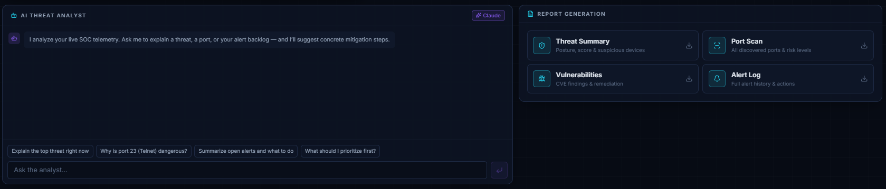

<div align="center">

# 🛡️ SENTINEL SOC

### Real-time Security Operations Center dashboard

A full-stack, enterprise-styled cybersecurity monitoring platform — live network
telemetry, threat detection, vulnerability tracking, and AI-assisted analysis in
a modern, dark, glowing SOC interface.


</div>

---

## Overview

**SENTINEL SOC** is a full-stack Security Operations Center (SOC) dashboard that
looks and behaves like real enterprise security tooling. It visualizes a
monitored network in real time: connected devices, open ports, live packet
traffic, threat alerts, vulnerabilities, and geographic attack origins — with a
built-in **AI analyst** (Claude) that explains threats and recommends mitigations
in plain English.

The platform is designed to be **impressive out of the box and honest under the
hood**:

- 🟢 **Runs standalone.** The frontend ships with a stateful telemetry
  **simulator**, so the dashboard is fully alive with *zero backend* — realistic
  device fingerprints, structured traffic flows, and MITRE-tagged attack
  scenarios.
- 🔵 **Goes live with the backend.** Start the FastAPI engine and the same
  panels stream over **WebSocket** from a real server, backed by a **live NIST
  NVD** vulnerability feed, **PostgreSQL** event log, and **Redis** cache. The
  status pill flips from `SIMULATION` to `LIVE`.
- ♻️ **Degrades gracefully.** Every external dependency (Postgres, Redis,
  Claude, NVD, Nmap, Scapy) is optional — the app never breaks when one is
  absent.

---

## Features

| # | Module | Description |
|---|--------|-------------|
| 1 | **Live summary bar** | Threats today, open ports, suspicious IPs, failed logins, active devices, system health — animated count-up cards with sparklines |
| 2 | **Threat gauge** | Radial security-posture score (1–100) with severity banding and live severity breakdown |
| 3 | **Interactive network map** | Cytoscape graph of the local network; click a node for a full **device fingerprint** (OUI vendor, OS, VLAN, ports); suspicious hosts flagged red |
| 4 | **Port scanner** | Searchable / sortable / risk-filtered table; dangerous ports (22, 23, 3389, 445 …) highlighted |
| 5 | **Threat timeline** | Live multi-series Chart.js — login attempts, port scans, suspicious traffic, blocked threats |
| 6 | **Packet inspection feed** | `tcpdump`-style live console with **structured flows** (TCP handshakes, DNS Q/R, TLS, ARP) and flagged attack patterns (scans, C2 beacons, exfil) |
| 7 | **Vulnerability scanner** | CVE cards sorted by severity with CVSS + remediation — backed by a **live NVD feed** |
| 8 | **Geo-IP attack map** | Leaflet world map with animated attack vectors converging on HQ + per-country stats |
| 9 | **Alert center** | Real-time, color-coded, **MITRE ATT&CK-tagged** attack scenarios with recommended actions; acknowledge/clear + sound on critical |
| 10 | **AI threat analyst** | Claude explains detected threats, why a port/service is dangerous, and mitigation steps (heuristic fallback when offline) |
| 11 | **Reports** | Export threat / port / vulnerability / alert reports as **PDF** (jsPDF) |
| + | **Extras** | JWT auth with roles, searchable event log (`/api/events`), manual scan, pause/auto-refresh, sound toggle, threat-severity scoring, responsive layout, subtle grid + neon aesthetic |

---

## Architecture

Single-origin design: the browser only ever talks to **nginx**, which serves the
static SPA and reverse-proxies the REST API and WebSocket to the backend.



### Real-time data flow



### Project structure

```
soc-dashboard/
├─ docker-compose.yml        # frontend + backend + postgres + redis
├─ .env.example              # compose configuration
├─ frontend/                 # React SPA (nginx in prod)
│  ├─ Dockerfile · nginx.conf
│  └─ src/
│     ├─ components/{layout,ui,panels}   # NetworkMap, PortScanner, PacketFeed, …
│     ├─ hooks/useLiveFeed.ts            # WebSocket client w/ simulator fallback
│     ├─ lib/                            # types, mock engine, api, formatters
│     ├─ store/                          # Zustand (auth + SOC state)
│     └─ pages/{Login,Dashboard}.tsx
└─ backend/                  # FastAPI engine
   ├─ Dockerfile
   └─ app/
      ├─ main.py        # routes + WebSocket endpoint + lifespan
      ├─ auth.py        # JWT / RBAC (bcrypt)
      ├─ telemetry.py   # device / traffic / scenario engine (Nmap-aware)
      ├─ ws.py          # WebSocket broadcaster + background loops
      ├─ nvd.py         # live NIST NVD CVE feed (Redis-cached)
      ├─ db.py          # PostgreSQL event log (asyncpg)
      ├─ cache.py       # Redis client
      ├─ ai.py          # Claude threat explanations
      └─ schemas.py     # Pydantic models (mirror the TS types)
```

---

## Tech stack

| Layer | Technologies |
|-------|--------------|
| **Frontend** | React 19, TypeScript, Vite 5, Tailwind CSS 3, Zustand, React Router, Chart.js, Cytoscape.js, Leaflet, jsPDF, Framer Motion, lucide-react |
| **Backend** | Python 3.12, FastAPI, Uvicorn, Pydantic v2, WebSockets, python-jose (JWT), bcrypt, httpx |
| **Data** | PostgreSQL 16 (asyncpg), Redis 7 |
| **AI & threat intel** | Anthropic **Claude API** (Haiku 4.5), **NIST NVD API** 2.0 |
| **Infra** | Docker, Docker Compose, nginx |
| **Optional (host)** | Nmap (host discovery), Scapy (packet capture) |

---

## Screenshots

<div align="center">

### Live dashboard



</div>

| Secure login | Port scanner & live packet inspection |
|:---:|:---:|
|  |  |

| Live NVD vulnerabilities & Geo-IP attack map | AI threat analyst & PDF reports |
|:---:|:---:|
|  |  |

> Screenshots live in [`docs/screenshots/`](docs/screenshots/) — see that folder's
> README for the exact filenames.

---

## Setup

### Option A — Docker (recommended)

Brings up the entire stack (frontend + backend + PostgreSQL + Redis) with one command:

```bash
cd soc-dashboard
cp .env.example .env          # optionally set ANTHROPIC_API_KEY / secrets
docker compose up --build
```

- **Dashboard** → <http://localhost:8080>
- **API docs (Swagger)** → <http://localhost:8000/docs>

Healthchecks gate startup (`backend` waits for a healthy Postgres + Redis;
`frontend` waits for a healthy backend). Data persists in named volumes
(`pgdata`, `redisdata`).

```bash
docker compose logs -f backend    # follow logs
docker compose down               # stop
docker compose down -v            # stop + wipe volumes
```

### Option B — Local dev (no Docker)

**Frontend** (works standalone with the simulator):

```bash
cd frontend
npm install
npm run dev            # http://localhost:5173
```

**Backend** (real-time data + AI + optional Postgres/Redis):

```bash
cd backend
python -m venv .venv
. .venv/Scripts/activate           # Windows
# source .venv/bin/activate        # macOS / Linux
pip install -r requirements.txt
cp .env.example .env               # set ANTHROPIC_API_KEY for live AI
uvicorn app.main:app --reload --port 8000
```

Vite proxies `/api` and `/ws` to `:8000`, so the dashboard picks up the live
engine automatically.

### Environment variables

All configuration is env-driven (`.env`). Key variables:

| Variable | Default | Purpose |
|----------|---------|---------|
| `ANTHROPIC_API_KEY` | — | Enables live Claude AI analysis (heuristic fallback if unset) |
| `SOC_AI_MODEL` | `claude-haiku-4-5` | Model for the AI analyst |
| `SOC_JWT_SECRET` | dev default | **Change in production** — signs JWTs |
| `DATABASE_URL` | — | PostgreSQL DSN for the event log (set automatically in Compose) |
| `REDIS_URL` | — | Redis URL for the NVD cache (set automatically in Compose) |
| `SOC_NVD_ENABLED` | `1` | Toggle the live NIST NVD feed |
| `SOC_NVD_API_KEY` | — | Optional — raises NVD rate limits |
| `SOC_SCAN_ENABLED` | `0` | Real Nmap host discovery (needs the `nmap` binary) |
| `SOC_SNIFF_ENABLED` | `0` | Real Scapy capture (needs admin/root + Npcap on Windows) |

---

## Deploy

Production is a **decoupled** stack — **Vercel** (frontend) + **Render** (backend)
+ **Supabase** (Postgres) — running **simulated telemetry only** (real Nmap/Scapy
scans stay local). Blueprints live in [`render.yaml`](render.yaml) and
[`frontend/vercel.json`](frontend/vercel.json).

[](https://render.com/deploy?repo=https://github.com/PrePotato/sentinel-soc)
&nbsp;
[](https://vercel.com/new/clone?repository-url=https://github.com/PrePotato/sentinel-soc&root-directory=frontend&env=VITE_API_URL&envDescription=Backend%20origin%20(your%20Render%20URL))

**Order:** deploy the backend on Render first (copy its URL) → deploy the frontend
on Vercel with `VITE_API_URL` set to that URL. Full walkthrough — including the
Supabase database — is in **[DEPLOY.md](DEPLOY.md)**.

---

## Demo credentials

| Username | Password | Role | Access |
|----------|----------|------|--------|
| `admin` | `admin` | **Admin** | Full — including manual scan |
| `viewer` | `viewer` | **Viewer** | Read-only |

> These demo accounts exist for local evaluation only. Replace them (and
> `SOC_JWT_SECRET`) before any real deployment.

---

## Security considerations

- **Secrets via environment only** — no credentials or API keys are hard-coded;
  everything comes from `.env` / environment variables.
- **Authentication** — JWT (HS256) with role-based access control (`admin` /
  `viewer`); passwords are **bcrypt**-hashed; protected endpoints reject
  unauthenticated requests with `401`, and admin-only routes with `403`.
- **Single origin** — in production nginx serves the SPA and proxies the API/WS,
  so the browser has one origin and **no CORS surface**; direct-to-API origins
  are allow-listed via `SOC_CORS_ORIGINS`.
- **Least privilege** — the backend container runs as a **non-root** user;
  PostgreSQL and Redis are only reachable on the internal Compose network.
- **Authorized use only** — real packet capture (Scapy) and network scanning
  (Nmap) require elevated privileges and must **only** target networks you are
  authorized to test; both are **disabled by default**.
- **Server-side AI** — the Claude API key lives only on the backend; the browser
  never sees it. AI calls degrade to a local heuristic when no key is set.
- **Demo hardening checklist for production** — replace demo users with a real
  identity store, rotate `SOC_JWT_SECRET`, put the stack behind TLS, add rate
  limiting, and enable persistent audit logging.

---

## Future improvements

- 🔌 **Live capture** — wire the Scapy sniffer directly into the WebSocket for
  real packet telemetry (privileged mode).
- 🧭 **MITRE ATT&CK matrix** — a panel mapping active alerts onto the tactics/
  techniques grid.
- 🔎 **Event Log UI** — a searchable, filterable front-end panel over the
  PostgreSQL-backed `/api/events` endpoint.
- 🌐 **Threat-intel enrichment** — integrate AbuseIPDB / AlienVault OTX to score
  external IPs seen in the packet feed.
- 📈 **Metrics** — Prometheus + Grafana for engine and infrastructure metrics.
- 🔔 **Alerting integrations** — Slack / email / PagerDuty on critical alerts.
- 🔐 **Real auth** — database-backed users, refresh tokens, optional OAuth/SSO.
- 🧪 **Testing & CI** — unit/integration tests and a GitHub Actions pipeline that
  builds and pushes both images.
- ☸️ **Kubernetes** — a Helm chart for cluster deployment.
- 🎨 **Light theme** — an optional light mode alongside the default dark SOC theme.

---

<div align="center">

**Built as a full-stack engineering portfolio project.**
Frontend + backend + real-time streaming + data stores + AI, containerized end to end.

</div>
